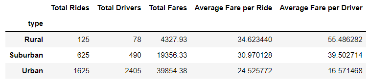
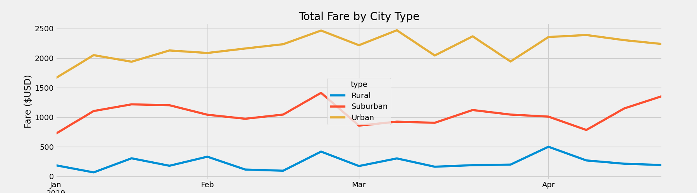

# Ride_Analysis

## Overview of Project
Executives at PyBer have requested a data analysis of ride sharing data in order to gain better insight into the fare and ride sharing metrics in the cities PyBer operates.

### Goals
- Import the ride sharing data and merge both sets of data into one usable data frame
- Clean and analyze the data to separate ride sharing into three main categories
    - Rural
    - Suburban
    - Urban
- Create a multiple-line graph that shows the total weekly fares for each city type

## Analysis

I first aggregated the PyBer data into a usable dataframe and created a summary of the statistical data shown below:

From this summary we can see that as expected Urban cities have the highest demand for ridesharing while Rural cities have the least. We can also determine from this dataset that Suburban cities have the most revenue overall as the rides-per-driver statistics even out.

In the chart above we see that the fares in Urban areas peak around March and slowly drop off during the month while the Suburban and Rural areas tend to plateau around the beginning of March. This would indicate that since there is more access to activities early in the spring in Urban areas that more rides are in demand.

## Summary
Based off the data provided I would suggest that the following ideas be considered:

- Increase number of drivers in both Suburban and Rural areas during the early spring months to accommodate more demand for access to activities only available in Urban areas.
- Increase the number of drivers overall in Rural areas since most people in those areas are riding further which in turn occupies drivers for a longer period thus allowing for a possible loss in income during peak hours/seasons
- Consider a further analysis of the times of day that most rides are happening to determine if certain areas are in more demand during peak hours than others
